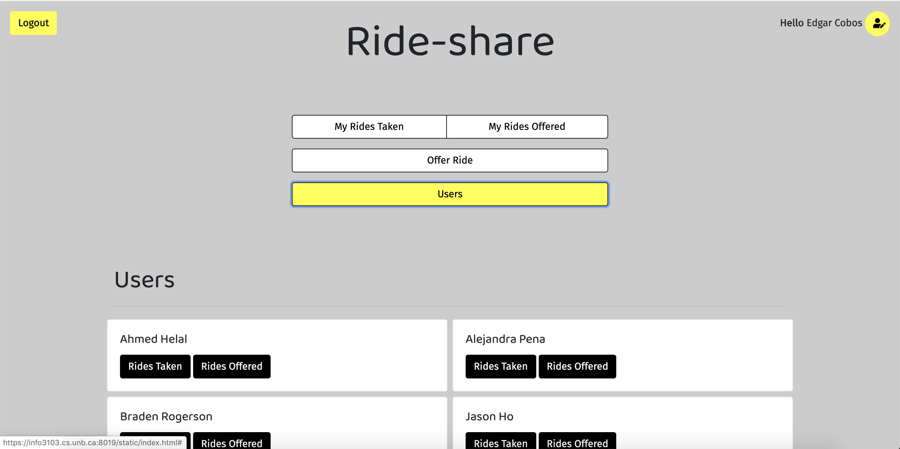

# ride-share

---

A ride-share web service using Flask-RESTful and Vue JS to power a Single Page Application, where users can offer rides and take those from other users. The service implements authentication, session management, and data transport, through JSON.
